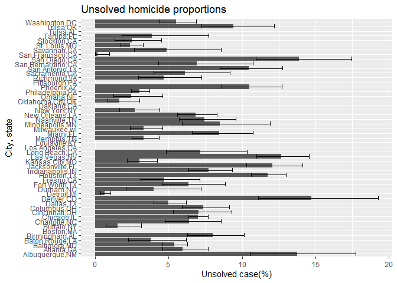
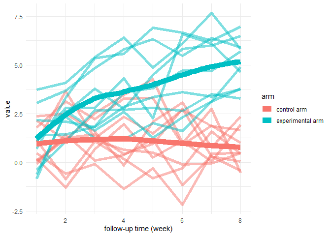

p8105\_hw5\_lg3158
================
Ling
11/12/2021

## Problem 1

``` r
q1_df = 
  read_csv(url("https://github.com/washingtonpost/data-homicides/raw/master/homicide-data.csv")) %>%
  mutate(city_state = paste(city, state, sep = ","))
```

    ## Rows: 52179 Columns: 12

    ## -- Column specification --------------------------------------------------------
    ## Delimiter: ","
    ## chr (9): uid, victim_last, victim_first, victim_race, victim_age, victim_sex...
    ## dbl (3): reported_date, lat, lon

    ## 
    ## i Use `spec()` to retrieve the full column specification for this data.
    ## i Specify the column types or set `show_col_types = FALSE` to quiet this message.

-   The data have 52179 observations and 13 variables (city,
    city\_state, disposition, lat, lon, reported\_date, state, uid,
    victim\_age, victim\_first, victim\_last, victim\_race, victim\_sex)
    after create the `city_state` variable.
-   Summarize total homicide and unsolved homicide
    -   create a data summarize total homicide number by city
    -   create a data only including the unsolved homicide, and
        summarize the total number by city
    -   combine the 2 data by city
    -   show the first 5 rows

``` r
q1_tot = q1_df %>%
  group_by(city_state) %>%
  summarise(total = n())

q1_unsolved = q1_df %>%
  filter(disposition %in% c("Closed without arrest","Open/no arrest")) %>%
  group_by(city_state) %>%
  summarise(unsolved = n())

q1_summary = left_join(q1_tot, q1_unsolved, by = "city_state")

knitr::kable(q1_summary[1:5, ])
```

| city\_state    | total | unsolved |
|:---------------|------:|---------:|
| Albuquerque,NM |   378 |       52 |
| Atlanta,GA     |   973 |       58 |
| Baltimore,MD   |  2827 |      152 |
| Baton Rouge,LA |   424 |       16 |
| Birmingham,AL  |   800 |       64 |

-   `prop.test`
    -   Baltimore result

``` r
q1_balt =
  prop.test(pull(subset(q1_summary, city_state == "Baltimore,MD"),unsolved), 
            pull(subset(q1_summary, city_state == "Baltimore,MD"),total)) %>%
  broom::tidy() %>%
  mutate(city_state = "Baltimore,MD") %>%
  select(city_state, estimate, conf.low, conf.high)
knitr::kable(q1_balt)
```

| city\_state  |  estimate | conf.low | conf.high |
|:-------------|----------:|---------:|----------:|
| Baltimore,MD | 0.0537672 | 0.045878 | 0.0628933 |

-   all other cities result, show the first 5 rows

``` r
fx_proc = function(dat)
  {
  if (is.na(dat$unsolved))
  {
    return(c(NA, NA, NA))
  }
  
  prop = prop.test(dat$unsolved, dat$total) %>%
    broom::tidy() %>%
    select(estimate, conf.low, conf.high)
  return(prop)
}

q1_list = 
  nest(q1_summary, data = total:unsolved)

q1_list_result = q1_list %>%
mutate(result = map(q1_list$data, fx_proc)) %>%
  unnest(cols = c(data, result)) %>%
  select(-result)

knitr::kable(q1_list_result[1:5, ])
```

| city\_state    | total | unsolved |  estimate |  conf.low | conf.high |
|:---------------|------:|---------:|----------:|----------:|----------:|
| Albuquerque,NM |   378 |       52 | 0.1375661 | 0.1053008 | 0.1773988 |
| Atlanta,GA     |   973 |       58 | 0.0596095 | 0.0459409 | 0.0768603 |
| Baltimore,MD   |  2827 |      152 | 0.0537672 | 0.0458780 | 0.0628933 |
| Baton Rouge,LA |   424 |       16 | 0.0377358 | 0.0224545 | 0.0618420 |
| Birmingham,AL  |   800 |       64 | 0.0800000 | 0.0625900 | 0.1015566 |

-   plot for unsolved homicide cases

``` r
q1_plot = q1_list_result %>%
  ggplot(aes(x = city_state, y = estimate*100)) +
    geom_bar(stat = "identity") +
    geom_errorbar(aes(ymin = conf.low*100, ymax = conf.high*100), stat = "identity") +
    labs(title = "Unsolved homicide proportions",
         x = "City, state",
         y = "Unsolved case(%)") +
  coord_flip()

q1_plot
```

    ## Warning: Removed 18 rows containing missing values (position_stack).

<!-- -->

## Problem 2

-   download and unzip the zip file
-   construct a dataframe which contains
    -   all the file name (`filename`)
    -   from `filename`, extract experimental arm or control arm (`arm`)
        and subject id (`ID`)
    -   read in data (a list named as `data`)
        -   before read in data, create a function named `readin` to
            load the csv data
    -   unnest the list `data`
    -   make `arm` values more readable
    -   drop `filename`
    -   make the columns `week_01`-`week_08` into 2 columns: `fu_time`
        and `value`
-   show the first 10 rows

``` r
download.file(url = "https://www.p8105.com/data/hw5_data.zip", destfile = "./data/hw5_data.zip")
unzip("./data/hw5_data.zip", exdir = ".")


readin = function(indata){
  data = read_csv(file = paste("./data/",indata, sep = ""))
  return(data)
}

q2_files = tibble(
  filename = list.files(path = "./data", pattern = "*.csv"),
  arm = substring(filename, 1,3),
  ID = substring(filename, 1,6),
  data = map(filename,readin)
  ) %>%
  unnest(cols = data) %>%
  mutate(arm = if_else(arm == "con", "control arm", "experimental arm")) %>%
  select(-filename) %>%
  pivot_longer(cols = starts_with("week_"), names_to = "fu_time", names_prefix = "week_", values_to = "value") %>%
  mutate(fu_time = as.numeric(fu_time))
```

    ## Rows: 1 Columns: 8

    ## -- Column specification --------------------------------------------------------
    ## Delimiter: ","
    ## dbl (8): week_1, week_2, week_3, week_4, week_5, week_6, week_7, week_8

    ## 
    ## i Use `spec()` to retrieve the full column specification for this data.
    ## i Specify the column types or set `show_col_types = FALSE` to quiet this message.

    ## Rows: 1 Columns: 8

    ## -- Column specification --------------------------------------------------------
    ## Delimiter: ","
    ## dbl (8): week_1, week_2, week_3, week_4, week_5, week_6, week_7, week_8

    ## 
    ## i Use `spec()` to retrieve the full column specification for this data.
    ## i Specify the column types or set `show_col_types = FALSE` to quiet this message.

    ## Rows: 1 Columns: 8

    ## -- Column specification --------------------------------------------------------
    ## Delimiter: ","
    ## dbl (8): week_1, week_2, week_3, week_4, week_5, week_6, week_7, week_8

    ## 
    ## i Use `spec()` to retrieve the full column specification for this data.
    ## i Specify the column types or set `show_col_types = FALSE` to quiet this message.

    ## Rows: 1 Columns: 8

    ## -- Column specification --------------------------------------------------------
    ## Delimiter: ","
    ## dbl (8): week_1, week_2, week_3, week_4, week_5, week_6, week_7, week_8

    ## 
    ## i Use `spec()` to retrieve the full column specification for this data.
    ## i Specify the column types or set `show_col_types = FALSE` to quiet this message.

    ## Rows: 1 Columns: 8

    ## -- Column specification --------------------------------------------------------
    ## Delimiter: ","
    ## dbl (8): week_1, week_2, week_3, week_4, week_5, week_6, week_7, week_8

    ## 
    ## i Use `spec()` to retrieve the full column specification for this data.
    ## i Specify the column types or set `show_col_types = FALSE` to quiet this message.

    ## Rows: 1 Columns: 8

    ## -- Column specification --------------------------------------------------------
    ## Delimiter: ","
    ## dbl (8): week_1, week_2, week_3, week_4, week_5, week_6, week_7, week_8

    ## 
    ## i Use `spec()` to retrieve the full column specification for this data.
    ## i Specify the column types or set `show_col_types = FALSE` to quiet this message.

    ## Rows: 1 Columns: 8

    ## -- Column specification --------------------------------------------------------
    ## Delimiter: ","
    ## dbl (8): week_1, week_2, week_3, week_4, week_5, week_6, week_7, week_8

    ## 
    ## i Use `spec()` to retrieve the full column specification for this data.
    ## i Specify the column types or set `show_col_types = FALSE` to quiet this message.

    ## Rows: 1 Columns: 8

    ## -- Column specification --------------------------------------------------------
    ## Delimiter: ","
    ## dbl (8): week_1, week_2, week_3, week_4, week_5, week_6, week_7, week_8

    ## 
    ## i Use `spec()` to retrieve the full column specification for this data.
    ## i Specify the column types or set `show_col_types = FALSE` to quiet this message.

    ## Rows: 1 Columns: 8

    ## -- Column specification --------------------------------------------------------
    ## Delimiter: ","
    ## dbl (8): week_1, week_2, week_3, week_4, week_5, week_6, week_7, week_8

    ## 
    ## i Use `spec()` to retrieve the full column specification for this data.
    ## i Specify the column types or set `show_col_types = FALSE` to quiet this message.

    ## Rows: 1 Columns: 8

    ## -- Column specification --------------------------------------------------------
    ## Delimiter: ","
    ## dbl (8): week_1, week_2, week_3, week_4, week_5, week_6, week_7, week_8

    ## 
    ## i Use `spec()` to retrieve the full column specification for this data.
    ## i Specify the column types or set `show_col_types = FALSE` to quiet this message.

    ## Rows: 1 Columns: 8

    ## -- Column specification --------------------------------------------------------
    ## Delimiter: ","
    ## dbl (8): week_1, week_2, week_3, week_4, week_5, week_6, week_7, week_8

    ## 
    ## i Use `spec()` to retrieve the full column specification for this data.
    ## i Specify the column types or set `show_col_types = FALSE` to quiet this message.

    ## Rows: 1 Columns: 8

    ## -- Column specification --------------------------------------------------------
    ## Delimiter: ","
    ## dbl (8): week_1, week_2, week_3, week_4, week_5, week_6, week_7, week_8

    ## 
    ## i Use `spec()` to retrieve the full column specification for this data.
    ## i Specify the column types or set `show_col_types = FALSE` to quiet this message.

    ## Rows: 1 Columns: 8

    ## -- Column specification --------------------------------------------------------
    ## Delimiter: ","
    ## dbl (8): week_1, week_2, week_3, week_4, week_5, week_6, week_7, week_8

    ## 
    ## i Use `spec()` to retrieve the full column specification for this data.
    ## i Specify the column types or set `show_col_types = FALSE` to quiet this message.

    ## Rows: 1 Columns: 8

    ## -- Column specification --------------------------------------------------------
    ## Delimiter: ","
    ## dbl (8): week_1, week_2, week_3, week_4, week_5, week_6, week_7, week_8

    ## 
    ## i Use `spec()` to retrieve the full column specification for this data.
    ## i Specify the column types or set `show_col_types = FALSE` to quiet this message.

    ## Rows: 1 Columns: 8

    ## -- Column specification --------------------------------------------------------
    ## Delimiter: ","
    ## dbl (8): week_1, week_2, week_3, week_4, week_5, week_6, week_7, week_8

    ## 
    ## i Use `spec()` to retrieve the full column specification for this data.
    ## i Specify the column types or set `show_col_types = FALSE` to quiet this message.

    ## Rows: 1 Columns: 8

    ## -- Column specification --------------------------------------------------------
    ## Delimiter: ","
    ## dbl (8): week_1, week_2, week_3, week_4, week_5, week_6, week_7, week_8

    ## 
    ## i Use `spec()` to retrieve the full column specification for this data.
    ## i Specify the column types or set `show_col_types = FALSE` to quiet this message.

    ## Rows: 1 Columns: 8

    ## -- Column specification --------------------------------------------------------
    ## Delimiter: ","
    ## dbl (8): week_1, week_2, week_3, week_4, week_5, week_6, week_7, week_8

    ## 
    ## i Use `spec()` to retrieve the full column specification for this data.
    ## i Specify the column types or set `show_col_types = FALSE` to quiet this message.

    ## Rows: 1 Columns: 8

    ## -- Column specification --------------------------------------------------------
    ## Delimiter: ","
    ## dbl (8): week_1, week_2, week_3, week_4, week_5, week_6, week_7, week_8

    ## 
    ## i Use `spec()` to retrieve the full column specification for this data.
    ## i Specify the column types or set `show_col_types = FALSE` to quiet this message.

    ## Rows: 1 Columns: 8

    ## -- Column specification --------------------------------------------------------
    ## Delimiter: ","
    ## dbl (8): week_1, week_2, week_3, week_4, week_5, week_6, week_7, week_8

    ## 
    ## i Use `spec()` to retrieve the full column specification for this data.
    ## i Specify the column types or set `show_col_types = FALSE` to quiet this message.

    ## Rows: 1 Columns: 8

    ## -- Column specification --------------------------------------------------------
    ## Delimiter: ","
    ## dbl (8): week_1, week_2, week_3, week_4, week_5, week_6, week_7, week_8

    ## 
    ## i Use `spec()` to retrieve the full column specification for this data.
    ## i Specify the column types or set `show_col_types = FALSE` to quiet this message.

``` r
knitr::kable(q2_files[1:10, ])
```

| arm         | ID      | fu\_time | value |
|:------------|:--------|---------:|------:|
| control arm | con\_01 |        1 |  0.20 |
| control arm | con\_01 |        2 | -1.31 |
| control arm | con\_01 |        3 |  0.66 |
| control arm | con\_01 |        4 |  1.96 |
| control arm | con\_01 |        5 |  0.23 |
| control arm | con\_01 |        6 |  1.09 |
| control arm | con\_01 |        7 |  0.05 |
| control arm | con\_01 |        8 |  1.94 |
| control arm | con\_02 |        1 |  1.13 |
| control arm | con\_02 |        2 | -0.88 |

-   the spaghetti plot

``` r
q2_plot = q2_files %>%
  ggplot(aes(x = fu_time, y = value, color = arm, group = ID)) +
    geom_line(alpha = 0.5, size = 2) +
    geom_smooth(aes(group = arm), se = F, size = 4) +
    labs(x = "follow-up time (week)") +
    theme_minimal()
q2_plot
```

    ## `geom_smooth()` using method = 'loess' and formula 'y ~ x'

<!-- -->

-   from the plot, we can see that the baseline values between the 2
    arms are similar, with different trends during the follow-up. The
    control arm almost kept constant while the experimental arm
    increased.

## Problem 3

-   create a function taking 1 vector (list) as an argument
    -   missing value imputation
-   using map to do the missing value imputation
    -   print the first 10 rows of the original data
    -   transform the original data into list, using `nest`
    -   using `map`
-   transform the result list into a dataframe
    -   print the first 10 rows

``` r
set.seed(10)

iris_with_missing = iris %>% 
  map_df(~replace(.x, sample(1:150, 20), NA)) %>%
  mutate(Species = as.character(Species))

knitr::kable(iris_with_missing[1:10, ])
```

| Sepal.Length | Sepal.Width | Petal.Length | Petal.Width | Species |
|-------------:|------------:|-------------:|------------:|:--------|
|          5.1 |         3.5 |          1.4 |         0.2 | setosa  |
|          4.9 |         3.0 |          1.4 |         0.2 | setosa  |
|          4.7 |         3.2 |          1.3 |         0.2 | setosa  |
|          4.6 |         3.1 |          1.5 |          NA | setosa  |
|          5.0 |         3.6 |          1.4 |         0.2 | setosa  |
|          5.4 |         3.9 |          1.7 |         0.4 | setosa  |
|           NA |         3.4 |          1.4 |         0.3 | setosa  |
|          5.0 |         3.4 |          1.5 |         0.2 | setosa  |
|          4.4 |         2.9 |          1.4 |         0.2 | setosa  |
|          4.9 |         3.1 |           NA |         0.1 | setosa  |

``` r
iris_list = iris_with_missing %>%
  nest(data = everything())
 
 fillin = function(var) {
  if (is.numeric(var)) {
    for (i in 1:150) {
    var[[i]] = if_else(is.na(var[[i]]), mean(var, na.rm = T), var[[i]])
    }
  }
  
  if (is.character(var)) {
    for (i in 1:150) {
      var[[i]] = if_else(is.na(var[[i]]),"virginica", var[[i]])
    }
  }
  return(var)
 }
 
iris_fill = tibble(
  var = c("Sepal.Length", "Sepal.Width", "Petal.Length","Petal.Width","Species"),
  fill = map(iris_list$data[[1]], fillin)) %>%
  pivot_wider(names_from = var, values_from = fill) %>%
  unnest( cols = c("Sepal.Length", "Sepal.Width", "Petal.Length","Petal.Width","Species"))

knitr::kable(iris_fill[1:10, ])
```

| Sepal.Length | Sepal.Width | Petal.Length | Petal.Width | Species |
|-------------:|------------:|-------------:|------------:|:--------|
|     5.100000 |         3.5 |     1.400000 |    0.200000 | setosa  |
|     4.900000 |         3.0 |     1.400000 |    0.200000 | setosa  |
|     4.700000 |         3.2 |     1.300000 |    0.200000 | setosa  |
|     4.600000 |         3.1 |     1.500000 |    1.192308 | setosa  |
|     5.000000 |         3.6 |     1.400000 |    0.200000 | setosa  |
|     5.400000 |         3.9 |     1.700000 |    0.400000 | setosa  |
|     5.819231 |         3.4 |     1.400000 |    0.300000 | setosa  |
|     5.000000 |         3.4 |     1.500000 |    0.200000 | setosa  |
|     4.400000 |         2.9 |     1.400000 |    0.200000 | setosa  |
|     4.900000 |         3.1 |     3.765385 |    0.100000 | setosa  |
